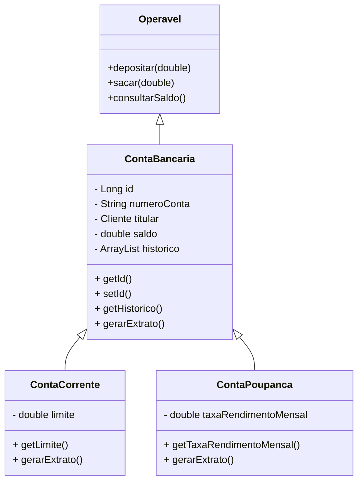

# TrabalhoFinal2 (Sistema Bancário)


## Visão Geral

Sistema desktop em arquitetura MVC/Camadas para gerenciamento de operações bancárias: saque, depósito, transferência com transações ACID, emissão de extratos e relatórios de auditoria. Possui controle de acesso por perfil (`ADMIN` e `OPERADOR`) e proteção de login contra ataques de força bruta.

> Arquitetura pensada para separar interface, regras de negócio e persistência de dados.

---

## Tecnologias Utilizadas

- **Linguagem:** Java (JDK 21)
- **Interface Gráfica:** Java Swing
- **Banco de Dados:** PostgreSQL
- **Criptografia:** SHA-256
  - `pgcrypto` no PostgreSQL
  - `MessageDigest` no Java
- **IDE:** NetBeans
- **Gerenciador de build:** Java Ant (projeto NetBeans)

---

## Estrutura de Pastas e Responsabilidades

| Pacote | Classe / Componente | Responsabilidade |
|---|---|---|
| `banco.app` | `SistemaBanco` | Ponto de entrada do sistema, configuração global de `Look and Feel` (Nimbus) e inicialização das telas. |
| `banco.dao` | `ConexaoDB` | Conexão com o banco, carregamento dinâmico de `db.properties`, isolamento de credenciais. |
|  | `Seguranca` | Hashing SHA-256, verificação de senha e proteção de login. |
|  | `UsuarioDAO` | Persistência de usuários, autenticação e controle de bloqueio. |
|  | `ClienteDAO` | Persistência de clientes do banco. |
|  | `ContaCorrenteDAO` | Operações de conta corrente, consulta de saldo, histórico e transações. |
|  | `ContaPoupancaDAO` | Operações de conta poupança, consulta de saldo, histórico e transações. |
| `banco.model` | `Usuario`, `Cliente` | Entidades de domínio que representam usuários e clientes. |
|  | `ContaBancaria` | Classe abstrata base com atributos comuns e interface `Operavel`. |
|  | `ContaCorrente` | Conta corrente com limite de cheque especial. |
|  | `ContaPoupanca` | Conta poupança com taxa de rendimento. |
| `banco.service` | `UsuarioService` | Regras de autenticação, bloqueio por tentativas falhas e validação de duplicidade. |
|  | `BancoService` | Regras de negócio bancário complexas: depósitos, saques, transferências ACID, geração de relatório e cálculo de patrimônio. |
| `banco.ui` | `TelaLogin` | Interface de login com proteção de temporizador/lockout para força bruta. |
|  | `TelaMenuPrincipal` | Menu principal com controle de visibilidade por perfil (`ADMIN` / `OPERADOR`). |
|  | `TelaOperacoes` | Tela de operações bancárias. |
|  | `TelaExtrato` | Tela de extrato com `JTable` dinâmica. |
|  | `TelaRelatorio` | Tela para geração de relatórios de auditoria. |
|  | `TelaGerenciarUsuarios` | Tela de administração de usuários. |

---

## Diagrama de Classes



---

## Como Compilar e Executar

### 1. Configuração do Banco de Dados

1. Abra o PostgreSQL e crie a extensão `pgcrypto`:

```sql
CREATE EXTENSION IF NOT EXISTS pgcrypto;
```

2. Crie o banco e as tabelas essenciais:

```sql
CREATE DATABASE "sistema-banco";
\c sistema-banco

CREATE TABLE usuarios (
  id serial PRIMARY KEY,
  login varchar(50) UNIQUE NOT NULL,
  senha_hash bytea NOT NULL,
  perfil varchar(10) NOT NULL,
  tentativas_falhas integer DEFAULT 0,
  bloqueado boolean DEFAULT false,
  ultima_tentativa timestamp
);

CREATE TABLE clientes (
  id serial PRIMARY KEY,
  nome varchar(100) NOT NULL,
  cpf varchar(20) UNIQUE NOT NULL,
  telefone varchar(20),
  endereco varchar(200)
);

CREATE TABLE contas_correntes (
  id serial PRIMARY KEY,
  numero_conta varchar(20) UNIQUE NOT NULL,
  saldo numeric(15,2) NOT NULL,
  limite_cheque numeric(15,2) NOT NULL,
  cliente_id integer REFERENCES clientes(id)
);

CREATE TABLE contas_poupanca (
  id serial PRIMARY KEY,
  numero_conta varchar(20) UNIQUE NOT NULL,
  saldo numeric(15,2) NOT NULL,
  taxa_rendimento numeric(5,2) NOT NULL,
  cliente_id integer REFERENCES clientes(id)
);

CREATE TABLE transacoes (
  id serial PRIMARY KEY,
  conta_id integer NOT NULL,
  tipo_conta varchar(10) NOT NULL,
  descricao varchar(255) NOT NULL,
  valor numeric(15,2) NOT NULL,
  data_hora timestamp DEFAULT CURRENT_TIMESTAMP
);
```

3. Insira o usuário administrador inicial `miguel`:

```sql
INSERT INTO usuarios (login, senha_hash, perfil)
VALUES (
  'miguel',
  digest('SENHA_PADRAO', 'sha256'),
  'ADMIN'
);
```

> Substitua `SENHA_PADRAO` pela senha que será usada no login.

### 2. Arquivo de Propriedades (`db.properties`)

Crie o arquivo de configuração do banco na pasta de recursos fonte do projeto, por exemplo:

- `src/db.properties`
- ou `src/main/resources/db.properties`

Conteúdo:

```properties
db.url=jdbc:postgresql://localhost:5432/sistema-banco
db.user=postgres
db.password=SuaSenhaAqui
```

- O sistema carrega este arquivo via `ConexaoDB.getConnection()`.
- Não versionar este arquivo: adicione-o ao `.gitignore`.

### 3. Compilação

#### No NetBeans

- Abra o projeto em NetBeans.
- Use `Clean and Build`.
- O resultado será gerado em `dist/`.

#### Via terminal

Se o projeto usar Ant no NetBeans:

```bash
ant clean
ant jar
```

Ou, se preferir compilação manual:

```bash
javac -d build/classes $(find banco -name "*.java")
```

### 4. Execução

Execute a partir da classe principal:

```bash
java -cp build/classes banco.app.SistemaBanco
```

Ou abra o `.jar` gerado em `dist/`:

```bash
java -jar dist/TrabalhoFinal2.jar
```

---

## Guia Bônus: Instalação do Zero (Linux)

### 1. Instalar Java JDK 21

```bash
sudo apt update
sudo apt install openjdk-21-jdk
java -version
```

### 2. Instalar PostgreSQL

```bash
sudo apt install postgresql postgresql-contrib
sudo systemctl start postgresql
sudo systemctl enable postgresql
```

### 3. Restaurar o banco de dados

1. Crie o banco de dados:

```bash
sudo -u postgres createdb sistema-banco
```

2. Entre no banco:

```bash
sudo -u postgres psql sistema-banco
```

3. Execute os comandos SQL de criação da extensão e tabelas.

### 4. Executar o projeto

1. Baixe o projeto ou extraia o `.zip`.
2. Abra no NetBeans e rode `Clean and Build`.
3. Garanta que `db.properties` esteja configurado.
4. Execute o `jar` em `dist/`:

```bash
cd /caminho/para/projeto
java -jar dist/TrabalhoFinal2.jar
```

---

## Imagens do Sistema


> Substitua os caminhos acima pelos arquivos de imagem reais se desejar incluir as capturas entregues.

---

## Notas Técnicas Importantes

- O sistema aplica `SHA-256` para senhas no backend Java e no banco de dados.
- A classe `BancoService` implementa lógica transacional de transferência com `Commit` e `Rollback`.
- `TelaExtrato` usa `JTable` dinâmica para exibir histórico de movimentos.
- `TelaLogin` possui controle de bloqueio/temporizador para proteção contra força bruta.

---

## Identificação do Aluno

- **Nome:** MIGUEL GARCIA DE SOUZA DUTRA
- **Turma:** 2° período de informática
